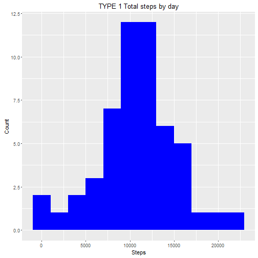
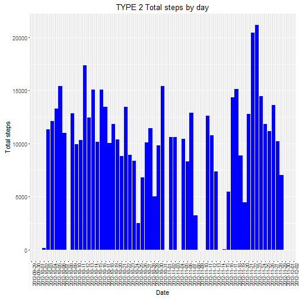
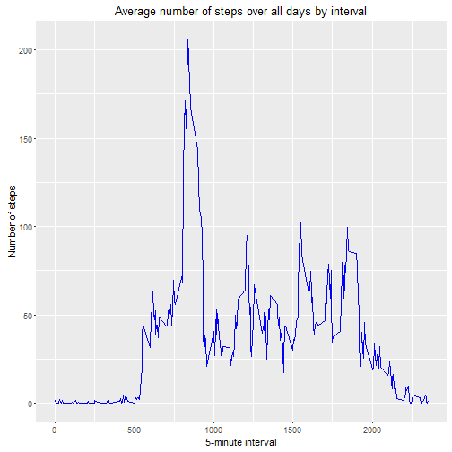
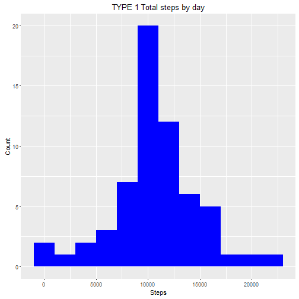
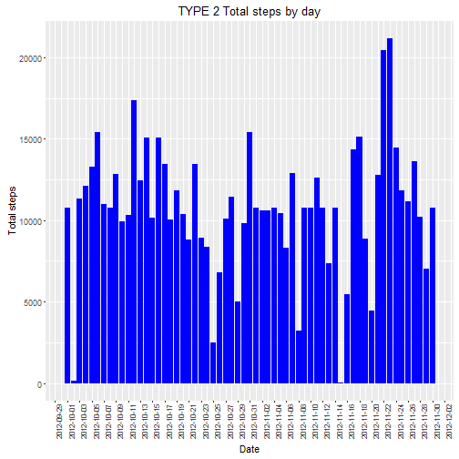
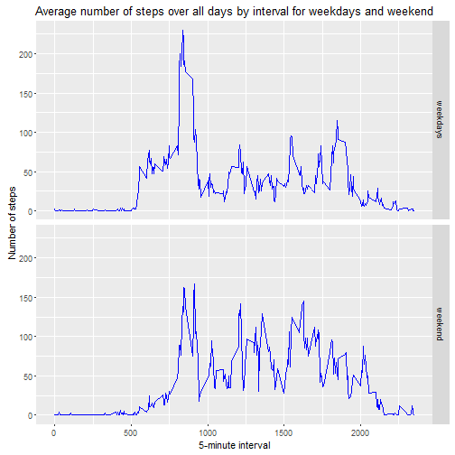

##Introduction

This is my submission for the Peer Graded Assignment:  Course Project 1 of Reproducible Research.  
This report makes use of data from a personal activity monitoring device. This device collects data at 5 minute intervals through out the day. The data consists of two months of data from an anonymous individual collected during the months of October and November, 2012 and include the number of steps taken in 5 minute intervals each day.

## Data


+ Dataset: [Activity monitoring data](https://d396qusza40orc.cloudfront.net/repdata%2Fdata%2Factivity.zip) [52K]

The variables included in this datas  et are:

+ **steps**: Number of steps taking in a 5-minute interval (missing values are coded as `NA`)

+ **date**: The date on which the measurement was taken in YYYY-MM-DD  format

+ **interval**: Identifier for the 5-minute interval in which
    measurement was taken

The dataset is stored in a comma-separated-value (CSV) file and there are a total of 17,568 observations in this dataset.  


#### setup

```r
knitr::opts_chunk$set(echo = TRUE)
# Load the library's without the message printed to the document.
suppressMessages(library(dplyr))
suppressMessages(library(ggplot2))
suppressMessages(library(lubridate))
```

#### Loading and preprocessing the data


```r
# Create a temp file for receiving the zip file
temp <- tempfile()
# Download the zipfile
download.file("https://d396qusza40orc.cloudfront.net/repdata%2Fdata%2Factivity.zip",temp)
# Assign the zip file to de activiy df and assign the right data types
activity <- read.csv(unz(temp, "activity.csv"), colClasses = c("integer","Date","integer") ,  stringsAsFactors = TRUE)
# Delete the tempfile
unlink(temp)
```


#### Make a histogram of the total number of steps taken each day
I make two versions of the histogram. The goal for the second one is to see the differance after imputing the data.

```r
# activity_total_steps is the sum steps grouped by date
activity %>% na.omit()  %>% group_by(date) %>% summarise(total_steps=sum(steps)) -> activity_total_steps
# Histogram Plot
ggplot(activity_total_steps, aes(x = total_steps))  + 
  geom_histogram(fill = "blue", binwidth = 2000) +
  labs(x="Steps" , y="Count" , title="TYPE 1 Total steps by day") 
```



```r
# Plot the activity by dy type 2
ggplot(activity_total_steps, aes(date,total_steps)) + 
    geom_bar(aes(y=total_steps), stat="identity", position="identity",fill="blue") + 
    labs(x="Date" , y="Total steps" , title="TYPE 2 Total steps by day") +
    scale_x_date(date_breaks='1 days')  +
    theme(axis.text.x=element_text(angle=90, size=8)) 
```



#### What is mean total number of steps taken per day?


```r
mean_total_steps <- round(mean(activity_total_steps$total_steps))
median_total_steps <- median(activity_total_steps$total_steps) 
```

+ The mean totalsteps a day is    **: 10766 **
+ The median of the total step is **: 10765 **
  
    

#### What is the average daily activity pattern?


```r
# step_interval is the grouped interval by day, without na
activity %>% na.omit()  %>% group_by(interval) %>% summarise(steps_mean_interval=mean(steps)) -> step_interval
# Plot the interval.
ggplot(step_interval, aes(interval, steps_mean_interval)) + geom_line(colour = "blue") + labs( title="Average number of steps over all days by interval",x="5-minute interval" , y="Number of steps") 
```



#### Find the row with max of steps

```r
# Add a column with the row number and filter the max mean
step_interval %>%  mutate( rownr=row_number()) %>%  filter(steps_mean_interval == max(steps_mean_interval) ) -> row_with_max
```
The row with the max steps is row 104 , with a round mean steps of 206 at interval 835 

#### Calculate and report the total number of missing values in the dataset (i.e. the total number of rows with NAs)

```r
row_na <- sum(!complete.cases(activity))
```
The total  number of rows with NAs is: 2304 
  
#### Devise a strategy for filling in all of the missing values in the dataset. 


```r
# Find out what is type of NA data
activity %>% group_by(date) %>% summarize(na_total=sum(is.na(steps)), total_intervals=n()) %>% filter(na_total != 0 )
```

```
## Source: local data frame [8 x 3]
## 
##         date na_total total_intervals
##       (date)    (int)           (int)
## 1 2012-10-01      288             288
## 2 2012-10-08      288             288
## 3 2012-11-01      288             288
## 4 2012-11-04      288             288
## 5 2012-11-09      288             288
## 6 2012-11-10      288             288
## 7 2012-11-14      288             288
## 8 2012-11-30      288             288
```
There ara 8 days with no measurements, so mayby not wearing the fitband. For impute it is the good way to do it with the mean for the interval.


```r
# Calculate the round mean of steps of a inverval
activity  %>%  na.omit()  %>% group_by(interval)  %>% summarise(mean_steps=round(mean(steps))) -> mean_interval_steps

# Join the mean_interval_steps with the activity table on inteval
# Replace the NA steps columns with the joined mean_steps
# select the right columns so we have the clean data set
activity %>% left_join(mean_interval_steps, by="interval") %>%
                mutate(steps = ifelse(is.na(steps), mean_steps, steps)) %>%
                select(steps,date,interval) -> activity_clean
# Check If we have a clean data set
row_na <- sum(!complete.cases(activity_clean))
```
The total  number of rows with NAs is: 0  
  
#### Create a new dataset that is equal to the original dataset but with the missing data filled in.

```r
write.csv(activity_clean, file = "activity_clean.csv")
```


#### Make a histogram of the total number of steps taken each day 
I decide to make two histograms. The seconde one is to see the change after imputting the data for NA's.


```r
activity_clean %>% group_by(date) %>% summarise(total_steps=sum(steps)) -> activity_total_steps_clean
# Histogram Plot
ggplot(activity_total_steps_clean, aes(x = total_steps))  + 
  geom_histogram(fill = "blue", binwidth = 2000) +
  labs(x="Steps" , y="Count" , title="TYPE 1 Total steps by day") 
```



```r
# Plot the activity by dy type 2 See the values for the Na's
ggplot(activity_total_steps_clean, aes(date,total_steps)) + 
  geom_bar(aes(y=total_steps), stat="identity", position="identity",fill="blue") + 
  labs(x="Date" , y="Total steps" , title="TYPE 2 Total steps by day") +
   scale_x_date(date_breaks='1 days') +
   theme(axis.text.x=element_text(angle=90, size=8)) 
```



In the histogram Type 2, we can clearly see that there is data imputed for the days with NA.  


#### What is mean total number of steps taken per day?


```r
mean_total_steps_clean <- round(mean(activity_total_steps_clean$total_steps))
```

The mean total number of steps taken per day after cleaning is: 10766  
The mean is the same, we omit the na in the first calculation and we impute the mean for an interval.

#### Are there differences in activity patterns between weekdays and weekends?


```r
# add a column with the weekday, day 1 and 7 are the weekends
activity_clean %>% mutate(weekday = ifelse(wday(date) %in% c(1, 7),"weekend","weekdays")) -> activity_clean
activity_clean$weekday <- as.factor(activity_clean$weekday)  
activity_clean  %>% group_by(interval,weekday) %>% summarise(steps_mean=mean(steps)) -> step_interval
ggplot(step_interval, aes(interval, steps_mean)) + geom_line(colour = "blue") + facet_grid(weekday ~ .) + labs( title="Average number of steps over all days by interval for weekdays and weekend",x="5-minute interval" , y="Number of steps") 
```


  
Yes in the weekend the activity start later. I love weekend's :-)


